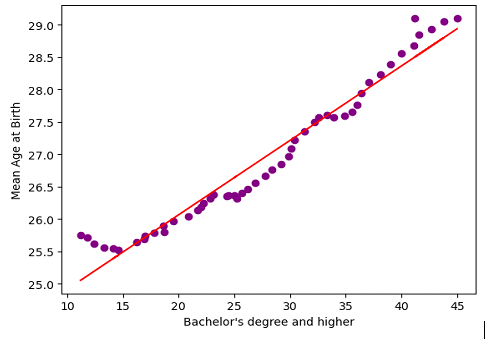
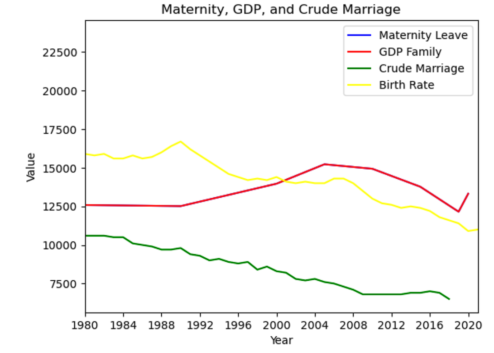

# Project 1: BIRTH RATE AND THE COLLAPSE OF A NATION!

## Project Overview 
Our group set out to answer this question: Why is birth rate decreasing in America? We decided to look at various variables that could contribute to this decline, including: housing affordability, alcohol consumption, loneliness, marriages, education, and more. Ultimately, we found the strongest correlation between birth rate and:  women pursuing higher education (r= 0.86), Annual Income 25 to 34 (r = -0.94) & Annual Home SalePrice (r = -0.93).

### Where is our data from?
- We all used birth rate data from Fred, Federal Reserve Economic Data. FRED is an online database consisting of hundreds of thousands of economic data time series from scores of national, international, public, and private sources.
- Other data sources used in this project include: OurWorldinData, U.S. Bureau of Labor Statistics, Human Fertility Database (HFD). 

## Technologies Used
- Python
- Pandas for data manipulation.
- Matplotlib for visualizations.
- Prophet for time series forecasting.
- Google colab to use prophet.
- Google chrome to organize our collaborative data and presentation before committing it to git. 

## How to navigate through our git project: 
Each of us had a git branch we used to commit our changes. All branches are now merged to main. Each group member has a folder with their name on. Within that folder you will find 3 directories: Datasets, Analysis, and Visuals. Therefore, to run the analysis using python in your local machine you would: (1) git clone this project to your local. (2) Navigate and cd into a group member folder. (3) Cd into the analysis folder and refer to the dataset folder when required to import csv data. 

## The Group 6 Approach 
Our approach to answer our main question "Why is birth rate decreasing?" consisted of individually looking for different variables we thought could affect birth rate and independently running analysis on birth rate and our chosen variables. Instead of everyone working on two to three main variables, we instead all used birth rate and each had one to two variables we used for analysis. In this way, each of us had mini projects we added to this main project to form a cohesive narrative to answer our principle question. From our main question, we each had subquestions related to birth rate. The group member name and subquestion is as follows: 
- Elphys: What is the relationship between births and U.S Income & Home Affordability & Consumer Sentiment?
- Eric: Whats the relationship between birth rates and alcohol consumption/isolation?
- Priscilla: What is the relationship between births and women pursuing higher education & the mean age women give birth?
- Michael: Whats the relationship between birth rates and marriages/Family Benefit Spending of GDP?
- Josephine: Whats the relationship between birth rate and inflation & US GDP? 

## Birth Rate Description 
The variable we all used for our analysis was birth rate. It is imperative to define here, what is birth rate? From the Fred database where we gathered our data, the definition is as follows "Crude birth rate indicates the number of live births occurring during the year, per 1,000 population estimated at midyear. Subtracting the crude death rate from the crude birth rate provides the rate of natural increase, which is equal to the rate of population change in the absence of migration." 
### Where are we headed?
Priscilla ran a prophet analysis using google colab to forecast birth rate for the next 20 years, from 2020 - 2040. Note, our birth rate data went up to 2019 which is why the 20 year forecast starts in 2020. The 2019 birth rate was at 11.4 and the last data point in the forecast, 2040, is predicted to have a birth rate of 8.02. According to this analysis birth rate in the United States is expected to continue to decline at a steady rate over the next 36 years. 

## Priscilla - What is the relationship between births and women pursuing higher education?
The decline in birth rate in the United States may be attributed to the fact that women are working more and pursuing higher education. We hypothesized that birth rate decrease would be correlated with increase in women pursuing higher education. These data were downloaded from the  U.S. Bureau of Labor Statistics. The dataset included the total number of civilians in the labor force (individual ages 25 to 64) shown by the thousands for each year, from 1970 - 1991 and the other dataset contained the same data from 1992 - 2019. Next to the total civilians in labor force for that year, we were shown percentages of people with less than a high school diploma, High school graduates (no college), Some college or associate's degree, and Bachelor's degree and higher. Below that part of the table, the index is subdivided by gender for the same range of years and percentages of either men or women that fell into the four educational categories mentioned above. The first couple of cells in Priscilla’s jupyter notebook were dedicated to extracting only the women education data, from this dataset that also contained education totals and male education statistics. The analysis of just those data showed that women became much more likely to pursue higher levels of education in the past 50 years: In 1970 11% of women had a bachelors or higher and in 2019 45% of women had a bachelors or higher. Meaning, the proportion of women in the labor force ages 25 to 64 who held a college degree more than quadrupled. 

The correlational analysis on the relationship between crude birth rate and varying levels of education had fairly high r values, all over 0.6. The correlation table contained the following results: 
- Birth rate and women with less than a high school diploma (r = 0.64), had a positive correlation. 
- Birth rate and women who graduated high school but didnt got to college (r = 0.86), had a strong positive correlation. Meaning that both births and women who didnt go to college decreased over the years at similar rates. 
- Birth rate and women who had some college or associate's degree (r = -0.65), had a negative correlation. 
- Birth rate and women who had a bachelor's degree and higher (r = -0.86), had a strong negative correlation.
The strong negative correlation between birth rate and women with bachelors degrees or higher was the most salient of the above correlations. It shows a strong relationship between higher education and a decrease in birth rates. Further analysis and charts were done on those two variables in a dataframe titled birth_women_core. 

Shortly after running analysis on birth rate and womens education over the past 50 years I also became interested in the average age a woman gives births. I gathered these data from the Human Fertility Database (HFD). Interestingly, in about the 1970s the mean age women gave birth was 25 and in 2021 the mean age was 29-30 years old. I also hypothesized that the mean age women give birth had increased because the number of women pursuing higher education also increased and thus in their early 20s were focused on getting their degree(s) instead of starting a family. This hypothesis was supported by the analysis with a strong correlation of r = 0.98, between women pursuing a bachelors degree or higher and the mean birth age.

Finally, I merged the birth_women_core dataframe, which contained birth rate and percentage of women with a bachelors degree or higher, with the mean age women gave birth dataframe. Between these three variables the correlational analysis revealed that birth rate and women’s mean age when they gave birth (r = - 0.88), had a strong negative correlation. The heatmap below shows the correlations between these 3 main variables and the line graph below shows these 3 variables over the years. 

--------------------------------------------------------------------------------------------------------------------------------------------------------------------------------------------------------------------------------------------------------------------------
## Mike 

The Graph Above:
The graph is displaying the relationship between Maternity Leave, GDP Family Spending, Crude marriage rate and birth rate. We can see the marriage rate is decreasing and in conjunction the birth rate is rapidly declining with that. The Pen we do not see is Maternity Leave, that is because there is no funding federally from this benefit. We are seeing multiple issues especially for our future as a nation, not having babies is fundamentally the beginning of the collapse of The United States. This aided with less marriages and no support for full-time working mothers shows a lack of support from politicians. I am a Veteran so I understand lack of support and seeing the lack of support for mothers is shameful on our policy makers. This graph is showing a decline in everything except GDP Family Spending which has had a sharp increase. Maybe this is the Government incentive for the birth rate and marriage to increase.

What's the relationship between birth rates and marriages? 
The relationship between marriages and birth rate is both declining, birth rate seems to be lowering at a more rapid pace than marriage. We can see that marriage and birth rate have a direct correlation with their spikes and decrease. This might be due to new social changes and younger generations wanting to wait and have a career first before having kids, or they just do not want to have children. Whatever the reasons are, both are declining and can have serious repercussions if not reversed. Maybe having better baby bonding or more tax breaks for having kids. 

What's the relationship between birth rate and Family Benefit Spending of GDP? 
This is an interesting one, GDP was consistent for ten years so did the birth rate and the marriage rate was slowly declining. Looks like in 1990 there was some sort of increase in spending for the Family Spending GDP and the birth rate at peak just declined rapidly! With the marriage rate declining at a steady pace. Seems like after 1990 the marriage and birth rate would not find recovery. 1990 seems to be the culprit for why there is a rapid decline, after this GDP had no effect on the birth rate or marriage rate. We can see it increased from 1990 to 2004 then declined until Covid in 2020 when there was a steady spike to increase. This did not change the birth rate. 

In conclusion there is a correlation between marriage and birth rate, most of us want to be married in order to have a child. But according to the data GDP has nothing to do with birth rate. Maternity Leave obviously does not change much because there is no data, but it would be interesting to see if that was a right to mothers and fathers and funded by our Government. Would that help the birth rate increase? In my opinion I think so but we shall see when the data is updated in 2025. 
